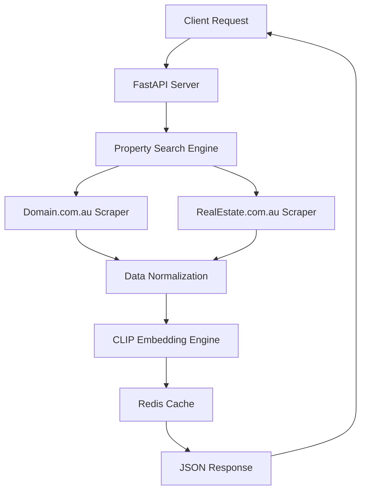

# 🏠 Real Estate CLIP API

A production-ready FastAPI service that intelligently searches and analyzes real estate properties using advanced web scraping and AI-powered image embeddings.

[](https://python.org)
[](https://fastapi.tiangolo.com)
[](https://docker.com)
[](https://kubernetes.io)
[](https://github.com/openai/CLIP)

## 🚀 Features

- **🔍 Intelligent Property Search**: Automatically searches property addresses across major Australian real estate platforms
- **🏢 Multi-Platform Support**: Integrated scrapers for `domain.com.au` and `realestate.com.au`
- **🤖 AI-Powered Analysis**: Extracts semantic embeddings from property images using OpenAI's CLIP model
- **⚡ High Performance**: Redis caching and async processing for optimal response times
- **🐳 Production Ready**: Dockerized with Kubernetes deployment manifests
- **📊 Comprehensive API**: RESTful endpoints with automatic OpenAPI documentation
- **🔒 Enterprise Security**: Non-root containers, proper secrets management, and CORS support

## 🏗️ Architecture



## 📋 Prerequisites

- **Python 3.11** (required for PyTorch compatibility)
- **Redis** (for response caching)
- **Docker** (for containerization)
- **Google Cloud SDK** (for deployment)
- **kubectl** (for Kubernetes management)

## 🛠️ Quick Start

### Local Development

1. **Clone and Setup Environment**
```bash
git clone <repository-url>
cd realestate-clip-api

# Create virtual environment
python3.11 -m venv .venv
source .venv/bin/activate  # On Windows: .venv\Scripts\activate

# Install dependencies
pip install -U pip
pip install -r requirements.txt
```

2. **Start Redis**
```bash
# macOS
brew install redis && brew services start redis

# Ubuntu/Debian
sudo apt install redis-server && sudo systemctl start redis

# Windows
# Download from https://github.com/tporadowski/redis/releases
```

3. **Configure Environment**


4. **Run the Application**
```bash
uvicorn app.main:app --host 0.0.0.0 --port 8000 --reload
```

5. **Access the API**
- **API Documentation**: http://localhost:8000/docs
- **Health Check**: http://localhost:8000/healthz
- **Root Endpoint**: http://localhost:8000/

## 🐳 Docker Deployment

### Build and Run Locally
```bash
# Build the image
docker build -t realestate-clip-api:latest .

# Run with environment variables
docker run --rm -p 8000:8000 \
  -e REDIS_HOST=host.docker.internal \
  -e SCRAPINGBEE_API_KEY="your_api_key" \
  -e RESPECT_ROBOTS_TXT=0 \
  -e REQUEST_TIMEOUT=90 \
  --name realestate-api \
  realestate-clip-api:latest
```

### Google Cloud Artifact Registry
```bash
# Configure Docker authentication
gcloud auth configure-docker australia-southeast1-docker.pkg.dev

# Build and push
docker build -t australia-southeast1-docker.pkg.dev/PROJECT_ID/REPO_NAME/IMAGE_NAME:TAG .
docker push australia-southeast1-docker.pkg.dev/PROJECT_ID/REPO_NAME/IMAGE_NAME:TAG
```

## ☸️ Kubernetes Deployment

### Prerequisites
- GKE cluster running
- kubectl configured
- Docker images pushed to Artifact Registry

### Deploy to GKE
```bash
# Apply Kubernetes manifests
kubectl apply -f kubernetes/resources.yaml

# Check deployment status
kubectl get pods -n property-ns
kubectl get services -n property-ns

# Get external IP
kubectl get service property-service -n property-ns
```

### Production Configuration
The Kubernetes deployment includes:
- **Horizontal Pod Autoscaler** (HPA) for automatic scaling
- **Pod Disruption Budget** (PDB) for high availability
- **Redis** with persistent storage
- **ConfigMaps** and **Secrets** for configuration management
- **LoadBalancer** service for external access

## 📚 API Reference

### Search Properties
```http
POST /search
Content-Type: application/json

{
  "address": "107/131 Sir Fred Schonell Drive, St Lucia, Qld 4067",
  "include_embeddings": true,
  "max_images": 12
}
```

**Response:**
```json
{
  "properties": [
    {
      "source": "domain",
      "url": "https://www.domain.com.au/property-url",
      "address": "107/131 Sir Fred Schonell Drive, St Lucia, Qld 4067",
      "price": "Contact agent",
      "bedrooms": 4,
      "bathrooms": 3,
      "parking": 2,
      "property_type": "Apartment",
      "description": "Modern apartment with city views",
      "features": ["Air conditioning", "Balcony", "Pool"],
      "image_urls": ["https://example.com/image1.jpg"],
      "image_embeddings": [[0.1, 0.2, ...]], // 512-dimensional vectors
      "floorplan_url": "https://example.com/floorplan.pdf",
      "agent_name": "John Smith",
      "agent_phone": "+61 400 000 000",
      "inspection_times": ["Saturday 2:00 PM"]
    }
  ]
}
```

### Health Check
```http
GET /healthz
```

### Configuration Debug
```http
GET /debug/config
```

### Cache Statistics
```http
GET /debug/cache
```

## 🔧 Configuration

### Environment Variables

| Variable | Description | Default |
|----------|-------------|---------|
| `REDIS_HOST` | Redis server hostname | `localhost` |
| `REDIS_PORT` | Redis server port | `6379` |
| `REDIS_DB` | Redis database number | `0` |
| `CACHE_TTL` | Cache time-to-live (seconds) | `172800` |
| `USER_AGENT` | HTTP User-Agent string | `Mozilla/5.0...` |
| `REQUEST_TIMEOUT` | HTTP request timeout (seconds) | `60` |
| `RESPECT_ROBOTS_TXT` | Respect robots.txt (0/1) | `1` |
| `CRAWL_DELAY` | Delay between requests (seconds) | `1` |
| `SCRAPINGBEE_API_KEY` | ScrapingBee API key for fallback | Required |

### Kubernetes Configuration

The application uses ConfigMaps and Secrets for configuration:

```yaml
# ConfigMap for non-sensitive data
apiVersion: v1
kind: ConfigMap
metadata:
  name: property-config
data:
  USER_AGENT: "Mozilla/5.0 (Windows NT 10.0; Win64; x64)..."
  REQUEST_TIMEOUT: "60"
  RESPECT_ROBOTS_TXT: "0"

# Secret for sensitive data
apiVersion: v1
kind: Secret
metadata:
  name: property-secrets
type: Opaque
stringData:
  SCRAPINGBEE_API_KEY: "your_api_key_here"
```

## 🧪 Testing

### Manual Testing
```bash
# Health check
curl http://localhost:8000/healthz

# Search properties
curl -X POST http://localhost:8000/search \
  -H "Content-Type: application/json" \
  -d '{
    "address": "36 Fifth Avenue, St Lucia, Qld 4067",
    "include_embeddings": true,
    "max_images": 3
  }'
```

### Automated Testing
```bash
# Run test suite
python -m pytest tests/

# Run with coverage
python -m pytest tests/ --cov=app

# Run specific test file
python -m pytest tests/test_api.py -v

# Run with detailed output
python -m pytest tests/ -v --tb=short
```

## 🚨 Troubleshooting

### Common Issues

**NumPy/PyTorch Installation Errors**
```bash
# Ensure Python 3.11 and upgrade pip
python --version  # Should be 3.11.x
pip install -U pip
pip install -r requirements.txt
```

**Redis Connection Issues**
```bash
# Check Redis status
redis-cli ping  # Should return PONG

# Check Redis logs
sudo journalctl -u redis  # On systemd systems
```

**Docker Build Failures**
```bash
# Clear Docker cache
docker system prune -a

# Rebuild without cache
docker build --no-cache -t realestate-clip-api:latest .
```

**Kubernetes Deployment Issues**
```bash
# Check pod logs
kubectl logs -n property-ns -l app=property-api

# Check service status
kubectl describe service property-service -n property-ns

# Check ingress
kubectl get ingress -n property-ns
```

### Performance Optimization

- **Enable Redis caching** for frequently accessed properties
- **Adjust HPA settings** based on traffic patterns
- **Use ScrapingBee API** for reliable web scraping
- **Monitor resource usage** with Kubernetes metrics

## 📈 Monitoring and Observability

### Health Checks
- **Liveness Probe**: `/debug/config` endpoint
- **Readiness Probe**: `/debug/config` endpoint
- **Health Endpoint**: `/healthz`

### Logging
- Structured logging with timestamps
- Request/response logging
- Error tracking with stack traces

### Metrics
- Response time monitoring
- Cache hit/miss ratios
- Scraping success rates

## 🤝 Contributing

1. Fork the repository
2. Create a feature branch (`git checkout -b feature/amazing-feature`)
3. Commit your changes (`git commit -m 'Add amazing feature'`)
4. Push to the branch (`git push origin feature/amazing-feature`)
5. Open a Pull Request

## 📄 License

This project is licensed under the MIT License - see the [LICENSE](LICENSE) file for details.

## 🙏 Acknowledgments

- [OpenAI CLIP](https://github.com/openai/CLIP) for the vision-language model
- [FastAPI](https://fastapi.tiangolo.com) for the web framework
- [Google Cloud Platform](https://cloud.google.com) for cloud infrastructure
- [Kubernetes](https://kubernetes.io) for container orchestration

## 📞 Support

For support and questions:
- Create an issue in the GitHub repository
- Check the [API documentation](http://localhost:8000/docs) for endpoint details
- Review the troubleshooting section above

---

**Built with ❤️ for intelligent real estate analysis**